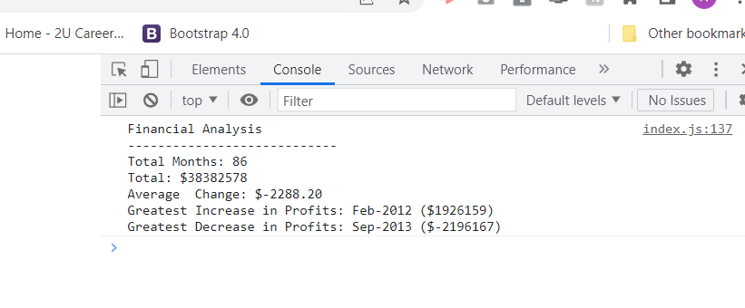

# Console-Finances

## Description

This application is used to munipulate data for a company's profit and loss data over a long period.

The company wanted an application to be built to check paticular data, such as profit and loss, and how long the data had been collected for.

JavaScript was used to build the application, and has been built in a way so that if more data is added the application will take this data into it's calculations.

My greatest challenge was getting a for loop to iterate over the array that held the finacial data to create a new array holding all the data that collects the differences in profit and loss each month.  I could not get the iteration variable (i) to go to the end of the array without getting an error because it's techinacally going to far.  The way I overcame the issue was to add an if statement to skip the zero index as the data needed to be collected from the first index to minus from the zero index.

The only other issues I had were small ones, such as missing semi-colons, spelling variable names wrong, syntax errors, which were all easily fixable once I found them.

## Table of Contents

- [Installation](#installation)
- [Usage](#usage)
- [Credits](#credits)
- [License](#license)

##  Installation

The Console Finances project is located here: [Console Finances](https://nickmbk.github.io/Console-Finances/)

## Usage

When you load the page and open the console,  the application shows the total amount of months that the data spans, the total of the profit and losses made over this period, the average changes each month, followed by the largest increase in profit and the largest decrease in losses and what month and year these happened.

To see the statistics, open the console in the web browser.

### Open Console in Browser 

Most browsers use Ctrl + Shift + J in Windows, Cmd + Option + J for Mac, or F12 in Windows will open the last panel, or Fn + F12 on Mac.

## Credits

Resources I have used have been Mozilla Developer Network (MDN) and some Stack Overflow posts

For general reference:
- [Array - JavaScript | MDN](https://developer.mozilla.org/en-US/docs/Web/JavaScript/Reference/Global_Objects/Array)

- [Loops and iteration - JavaScript | MDN](https://developer.mozilla.org/en-US/docs/Web/JavaScript/Guide/Loops_and_iteration#for_statement)

Trying to sort arrays within arrays to get the greatest profit and losses numbers: 
- [Sort an array of arrays in JavaScript - Stack Overflow](https://stackoverflow.com/questions/50415200/sort-an-array-of-arrays-in-javascript)

To display a float to two decimal places:
- [JavaScript displaying a float to 2 decimal places](https://stackoverflow.com/questions/3163070/javascript-displaying-a-float-to-2-decimal-places)

## License

I used no license for this project.